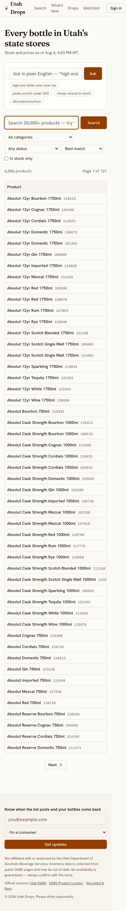
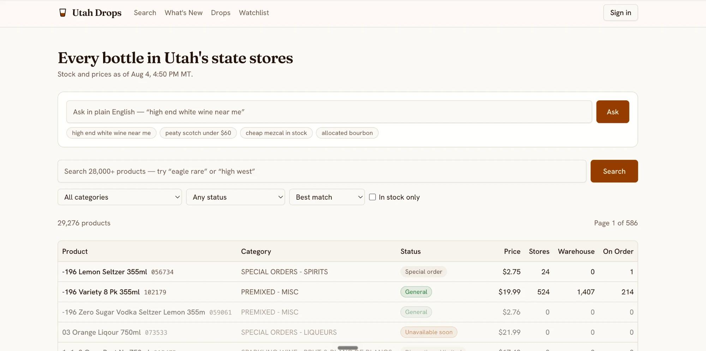
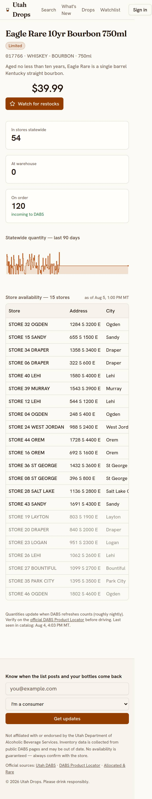

# Utah Drops: review and game plan

_Reviewed 2026-09-23 against `main` @ `feca277` (last commit 2026-06-14). No code was changed in this pass._

**How to read the evidence tags**

| Tag | Meaning |
|---|---|
| **[V]** | Verified: reproduced locally, observed in GitHub Actions logs/API, or measured |
| **[C]** | Code-traced: follows directly from reading the code, but not exercised against production |
| **[I]** | Inferred: plausible from the code/logs, but needs you (or prod access) to confirm |

**What I could and couldn't reach.** This review ran in a sandbox whose egress policy blocks
`utahdrops.com`, `abs.utah.gov` and `webapps2.abc.utah.gov`, so I could **not** view the live site,
hit DABS, or run Lighthouse against production. Instead I:

- ran `pnpm install`, `pnpm lint` and `pnpm build`
- stood up a local Postgres 16, applied the real migration (with a stub `auth` schema), and seeded
  ~6,000 **synthetic** DABS-shaped products, 47 stores, snapshots, events and an allocated list.
  The catalog freshness is pinned to Aug 4 to mirror what prod is probably showing now.
- mocked the Supabase Auth API so I could render signed-out and signed-in pages
- took Playwright screenshots (desktop 1366px, mobile 390px @2x), ran axe-core and Lighthouse locally
- pulled all 1,204 GitHub Actions runs through the public API and read the failure logs

The screenshots in `review/` therefore show **real UI with fake data**. Store names like "STORE 32
OGDEN" and the product mix are synthetic. The layout, copy, states and bugs are real.

**Update (same day):** you sent a screenshot of the live site
(`review/live-desktop-home-2026-09-23.jpg`, with your browser bar and bookmarks cropped out).
It confirms that prod is up and serving from the database, and that the data is frozen at
**"as of Aug 4, 4:50 PM MT"** (22:50Z, just before the catalog failure streak began). Findings
it confirms are now marked [V].

---

## 1. Executive summary

**Current state in 5 bullets**

1. **The site has been effectively dead for ~7 weeks.** GitHub disabled both scheduled workflows on
   **2026-08-13** (`disabled_inactivity`: public repos lose scheduled workflows after 60 days
   without a commit). Nothing has been scraped and no alert has been sent since then **[V]**.
   Before that, the **catalog job had already failed on every run since ~Aug 5** with
   `canceling statement due to statement timeout` **[V]**. Statewide prices and stock are
   frozen at **Aug 4, 2026, 4:50 PM MT**, and the live home page says exactly that **[V: live screenshot]**.
2. **The product is well built and the code is clean.** Scraper politeness, delta-encoded
   history, LLM-as-query-translator, compliance copy and OG images are all thoughtful. Build is
   green and typecheck is clean. **Lint fails (2 errors).** There are no tests, no CI, and nothing
   monitors whether jobs succeed.
3. **Several correctness bugs will bite as soon as the jobs run again:**
   - failing SKUs poison the store-inventory queue (this already caused a 10-day outage in
     June/July) **[V]**
   - the allocated list can be re-announced as a "new" drop, re-emailing everyone **[V/C]**
   - digests can double-send or silently skip events **[C]**
   - the connection pool can exhaust (`EMAXCONNSESSION`) **[V]**
   - there's an open redirect in `/auth/confirm` **[V]**
4. **Mobile, the main use case, is compromised.** At 390px the header forces a 441px layout, so
   every page renders zoomed out **[V]**. Results and store tables hide price and quantity
   off-screen. Keyword search can't find `makers mark`, `titos` or `blantons` because DABS names
   contain apostrophes **[V]**.
5. **Security hygiene needs a pass.** Next.js 16.2.9 has 2 critical and 4 high advisories (fix: ≥16.3.3)
   **[V: pnpm audit]**, `xlsx@0.18.5` is abandoned with known CVEs, `/api/nl-search` has no rate
   limit or spend cap, and the footer email capture collects addresses that nothing ever emails.

**Top 3 things to do next**

1. **Get the data flowing again, and make "dead" loud (Phase 0, about a day).** Fix the catalog
   timeout, then re-enable the workflows. Add a heartbeat/dead-man's-switch alert and an
   on-site staleness banner. Stop depending on GitHub cron staying enabled.
2. **Fix the alert-integrity bugs before anyone gets another email:** digest dedupe via a
   delivery log, allocated re-announcement, and store-inventory poison pills and starvation. The
   product *is* the alerts, and one duplicate "the list just posted!" email costs more trust than
   a missed one.
3. **Make it a great phone app:** fix the header overflow, use card rows instead of wide tables,
   normalize search (apostrophes, fuzzy matching), add "nearest store with stock" on the product
   page, and add per-store alerts ("back at *my* store").

---

## 2. Findings

Severity: **critical** (broken now / security-critical) · **high** · **med** · **low**. Effort: **S** (<½ day) · **M** (½–3 days) · **L** (>3 days).

### 2.1 Operations and reliability

| # | Area | Issue | Sev | Evidence | Suggested fix | Effort |
|---|---|---|---|---|---|---|
| O1 | Ops | **Both scheduled workflows are disabled.** GitHub auto-disabled `cron.yml` and `store-inventory.yml` on 2026-08-13, 60 days after the last push (public repo). Last runs were 2026-08-13 20:55Z (cron) and 2026-08-14 01:09Z (store). | critical | [V] Actions API: `state: disabled_inactivity`; `.github/workflows/*.yml` | Re-enable both in the Actions tab. Long term, don't depend on GitHub cron for a public repo: use Supabase `pg_cron`+`pg_net`, Vercel Cron (Pro), or cron-job.org hitting the endpoints. At minimum add a monthly keep-alive. | S |
| O2 | Reliability | **Catalog job fails every run since ~2026-08-05:** `PostgresError: canceling statement due to statement timeout` after ~2.5 min. That's 30 straight failures, so no price/stock updates, no events, and no restock alerts. | critical | [V] runs 31676331835, 31711970343 (logs); `lib/jobs/catalog.ts:105-126` | Most likely the snapshot CTE, which runs `DISTINCT ON` over **all** `inventory_snapshots` each pass and grows linearly (1M rows ≈ 125 MB, ~1 s warm locally [V], much slower on a small Supabase instance [I]). Other suspect: the 28k-row no-op upsert 3×/day (bloat). Check Supabase query logs to confirm. Fix: diff in memory against the `existing` map you already load (or keep `prev_*` columns on `products`); only upsert changed rows (`WHERE products.* IS DISTINCT FROM excluded.*`); run catalog in the Actions runner like store-inventory. | M |
| O3 | Monitoring | **Nobody noticed 41 days of downtime.** `scrape_runs` records failures but nothing reads it. There's no alerting, no health endpoint, and no staleness banner. The watchlist page still says "We check inventory a few times a day". | high | [V] Actions history; `lib/jobs/run.ts`; `app/watchlist/page.tsx:41` | Heartbeat ping (Healthchecks.io / Better Stack, free) after every successful job; `/api/health` returning 503 when catalog freshness exceeds 12h; site-wide banner when data is stale; GitHub "failed workflow" email on. | S |
| O4 | Reliability | **Store-inventory poison pill.** A SKU that errors never updates `last_store_scrape`, so it stays at the front of the queue (`nulls first` / oldest) and is retried every run. Each attempt retries 4× with backoff, and 5 such SKUs abort the run. Between Jun 28 and Jul 8, 20 runs hit the 30-min timeout and 3 more aborted this way. Retrying step 2 alone reuses a **single-use** TempData cookie, so those retries likely can't succeed [I]. | high | [V] run 28594555354: five `500 …/ProductDetail/Index` then abort; 20 `cancelled` runs; `lib/jobs/store-inventory.ts:38-48`, `lib/dabs/client.ts:40-63`, `lib/dabs/detail.ts:32-50` | On failure, set `last_store_scrape = now()` and track `store_scrape_failures` with exponential per-SKU backoff. Retry the **whole** 2-step flow. Don't retry the same 500 more than once. Make the circuit breaker count *consecutive* failures, not total. | M |
| O5 | Reliability | **Connection pool exhaustion:** `EMAXCONNSESSION max clients reached in session mode (pool_size 15)`. `lib/db.ts` opens up to 10 connections per serverless instance against the **session-mode** pooler. The `prepare:false` comment assumes transaction mode. | high | [V] run 30847536294; `lib/db.ts:14-18` | Use the transaction-mode pooler URL (port 6543) with `max: 1–3` on Vercel. Scripts in Actions can use session mode. | S |
| O6 | Reliability | **GitHub cron is lossy and late.** It averaged 11–25 cron runs/day against 29 scheduled, and start times drift up to ~55 min. The "hourly" digest is really every 1–2h. | med | [V] 961 scheduled cron runs analysed | Same fix as O1: move to a real scheduler. | S |
| O7 | Reliability | **`politeFetch` has no request timeout.** One hung DABS socket stalls the global queue until the 30-min job timeout, and `scrape_runs` rows are left with `ok = null`. | med | [C] `lib/dabs/client.ts:43` | `signal: AbortSignal.timeout(20_000)`; sweep for stale `scrape_runs` (treat as failed). | S |
| O8 | Ops | **Job-runtime inconsistencies.** Comments say Vercel Hobby has a 60s limit, but the route sets `maxDuration = 300`. The June 14 failures all took ~306s, meaning the function hit its max [I]. Catalog (~30+ DABS requests plus a 28k upsert) is still run through a serverless function. | med | [V] 7 failed runs of ~306s on 2026-06-13/14; `app/api/cron/[job]/route.ts:3`, `cron.yml:15-16` | Run every scraping job in the Actions runner (or on a small always-on worker). Keep the HTTP endpoints only for manual triggers. | S |
| O9 | Scale | **Unbounded history growth.** `inventory_snapshots`, `store_inventory` and `inventory_events` have no retention or rollup. On the Supabase free tier (500 MB cap) this runs out [I]. Free projects also **pause after 7 days of inactivity**. The live site is still serving data (so not paused as of 2026-09-23 [V]), but check the plan and size cap. | high | [V] local measurement: 125 MB per 1M snapshot rows | Check the Supabase dashboard today. Add daily rollups older than 90 days; prune `store_inventory` to change points; move to Pro ($25/mo) once there are real users. | M |
| O10 | Ops | Actions use Node 20-based `checkout@v4`/`setup-node@v4`/`pnpm/action-setup@v4` (deprecation warnings in logs). | low | [V] run logs | Bump to current majors. | S |

### 2.2 Correctness

| # | Area | Issue | Sev | Evidence | Suggested fix | Effort |
|---|---|---|---|---|---|---|
| C1 | Allocated | **Old list re-announced as a new drop.** `drop_date` comes from the *scrape time* (`currentDropDate()`), not the page. It rolls to next month at **Friday 6pm MT, 6 days after the drop**. If DABS leaves the list up past then, every row is re-inserted under next month's date, which counts as "new", emits another `allocated_drop` event, and emails every opted-in user "the allocated list just posted" with last month's bottles. | high | [V] edge test: `currentDropDate(2026-08-22T12:00Z) → 2026-09-19`; `lib/jobs/allocated.ts:15,27-33`, `lib/dabs/allocated.ts:25-30` | Parse the drop date from the page if DABS prints it. Otherwise hash the list content and only alert when the hash changes, and dedupe rows on `(product_name, store_text)` within ~45 days. | S |
| C2 | Allocated | **Shape-change guard never fires.** When no table matches, the scraper returns `[]` if the page body contains "ALLOCATED", which it always does (it's the page title). A markup change looks like "between drops", so the core drop feature fails silently. | high | [V] test with a renamed-header page returns `[]`, no error; `lib/dabs/allocated.ts:51-56` | Treat "no table" as an error unless a known "no current list" phrase is present. Alert when no list has been seen for >35 days. Save a fixture of the live page. | S |
| C3 | Digest | **Digests can double-send or miss events.** (a) The window is `created_at > last successful digest's started_at`. If a run fails midway (Resend 429, one bad address), the whole run is marked failed and the next run **resends to everyone already emailed**. (b) `created_at` is the inserting transaction's start time, so events committed late (long catalog run) can fall before `since` and be **missed**. (c) One permanently failing recipient fails the job forever while the backlog grows. The allocated blast has the same problems. | high | [C] `lib/jobs/digest.ts:25-76`, `lib/jobs/run.ts:32-37` | Add `alert_deliveries(user_id, event_id, sent_at)` with a unique key (or a per-user event-id high-water mark). Catch errors per recipient. Use Resend's batch API with an `Idempotency-Key`. | M |
| C4 | Store inv. | **Priority starvation.** The ordering is strictly `priority, last_store_scrape`. If watchlisted plus A/L/D SKUs ≥ budget (300 per run), general in-stock items are **never** refreshed. `D` includes out-of-stock clearance items, and there's no per-user watchlist cap, so one user watching 300 SKUs takes the whole budget. | high | [C] `lib/jobs/store-inventory.ts:16-30`; actual starvation depends on prod counts [I]. Check with `select status, count(*) from products where in_stock or status in ('A','L','D') group by 1;` | Score by staleness × weight (for example `age_hours * (w=5 watch, 3 A/L, 2 D in stock, 1 other)`). Require `in_stock` for D. Cap watchlists (e.g. 50). Log coverage % per run. | S |
| C5 | Store inv. | **Stores that sell out may never be zeroed.** `persistDetail` only upserts stores present on the detail page. If DABS omits zero-qty stores, stale positive quantities live forever, which feeds "phantom stock" to NL "near me" results. | high | [C] `lib/jobs/store-inventory.ts:86-111`; DABS behaviour unverified (blocked) [I] | After a successful parse, set `qty = 0` for `(csc, store_id)` rows not in the page, and record the history row. | S |
| C6 | Catalog | **Delisted products stay "in stock" forever.** Products missing from the feed are never reconciled, and queries ignore `last_seen`. | med | [C] `lib/jobs/catalog.ts:83-102`, `lib/queries.ts:36-47` | After a successful full pass, mark `in_stock=false, delisted_at=now()` where `last_seen < run start`. | S |
| C7 | Catalog | **Restock/out-of-stock flapping.** Statewide 0↔1 changes create an event and an email each time, so the feed and inboxes get noisy. | med | [C] `lib/jobs/catalog.ts:64-78` | Add hysteresis: require ≥N bottles or 2 consecutive passes; suppress repeats within 24h per SKU. | S |
| C8 | Catalog | **Bootstrap detection is `existing.length === 0`.** If the `xlsx` job ever runs first on a fresh DB, catalog emits ~18k `new_product` events. | low | [C] `lib/jobs/catalog.ts:32`, `lib/jobs/xlsx.ts:25-34` | Base bootstrap on "no successful catalog run" in `scrape_runs`. | S |
| C9 | Catalog | **Pagination sorts by `sku`, which is declared `orderable:false`.** If DABS ignores it, paging isn't stable and the only guard is the 95% coverage check (up to 5% silently skipped). | low | [C][I] `lib/dabs/catalog.ts:10,47` | Request 1000/page (already tried first). Fail if duplicates exceed 1%. Log fetched vs `recordsTotal`. | S |
| C10 | Allocated | **Store matching is exact address equality** (the comment claims fuzzy "street number + first word"). `csc` is never resolved, so drop cards don't link to products or live per-store stock. | med | [C] `lib/jobs/allocated.ts:35-43`, `lib/queries.ts:167-173` | Normalize addresses (number + street tokens) or map by store number if DABS shows it. Match product names to `products` with trigram similarity. | M |
| C11 | Dates | **Drops countdown off-by-one in MT.** It shows "It's drop day" on **Friday** evening and rolls to next month at **Saturday 6pm MT**. `thirdSaturday` itself is correct; the comparisons are UTC-midnight based. The "third Saturday" premise itself is unverified. | low | [V] edge test; `app/drops/page.tsx:32-37`, `app/drops/opengraph-image.tsx:13-18` | Compute "today" in `America/Denver` (`Intl`/`Temporal`) and compare calendar dates. Confirm the cadence against DABS. | S |
| C12 | Search | **`/?page=abc` returns HTTP 500** (NaN offset). | low | [V] `review/desktop-error-bad-page-param.jpg`; `app/page.tsx:35`, `lib/queries.ts:29` | Validate searchParams with zod; clamp page. | S |
| C13 | Format | **`displayName` mis-capitalizes:** "Maker'S Mark", "Tito'S", "Jack Daniel'S", "1.75l". | low | [V] edge test; `review/mobile-watchlist-signed-in.jpg` ("Blanton'S") | Capitalize only word starts not preceded by `'`; keep `L` uppercase. | S |
| C14 | Product | **Wrong "as of" timestamp.** The store table's "as of" uses `stores[0].scraped_at`, the row with the highest qty, not the latest scrape. | low | [C] `app/product/[csc]/page.tsx:59` | Use `max(scraped_at)`. | S |
| C15 | xlsx | **Loose header regexes.** `/DESC\|NAME/` can match a "CLASS DESC" column before the item description, and `isSpa` matches any value containing Y/X/1. | low | [C] `lib/dabs/xlsx.ts:55-98` | Save a fixture of the real file and match exact header names. | S |

### 2.3 Security

| # | Area | Issue | Sev | Evidence | Suggested fix | Effort |
|---|---|---|---|---|---|---|
| S1 | Deps | **Next.js 16.2.9 has 2 critical and 4 high advisories.** Critical: RCE in the Image Optimization API (AVIF) and on Windows hosts. High: proxy bypass (Turbopack), Server Action DoS/SSRF, and rewrite SSRF. Exposure on Vercel is probably lower (Vercel runs its own image optimizer) [I], but the fix is trivial. | critical | [V] `pnpm audit --prod` | Upgrade to `next@16.3.6` / `eslint-config-next@16.3.6`. Re-run build and lint. | S |
| S2 | Auth | **Open redirect in `/auth/confirm`.** `next` accepts absolute and protocol-relative URLs. A phisher sends `/login?next=https://evil…`, the victim signs in legitimately, and lands on the attacker's page right after a real login. | med | [V] local: `next=https://evil.example/phish` → `307 https://evil.example/phish`; `//evil.example` works too. `app/auth/confirm/route.ts:9,15`, `app/login/page.tsx:21` | Accept only `next` that starts with `/`, not `//` or `/\`. Otherwise fall back to `/`. | S |
| S3 | API | **`/api/nl-search` has no rate limit, no auth and no spend cap.** Each call is ~1.1k input + ~150 output Haiku tokens (≈$0.002 [I]), so a loop can run up a bill. The in-process `parseCache`/`geocode` maps are unbounded (memory), `lat/lng` are unvalidated, and the geocoder proxies Nominatim (their policy is 1 req/s). | med | [C] `app/api/nl-search/route.ts`, `lib/nl/parse.ts:40-47`, `lib/nl/geocode.ts:3` | Per-IP rate limit (Upstash/Vercel KV or a Postgres token bucket); daily spend cap plus an Anthropic console limit; LRU caches; zod-bound lat/lng to Utah; cache parses in the DB. | S |
| S4 | API | Prompt-injection impact is **low**. The model is forced into a tool schema, categories are filtered to the taxonomy, and `name_terms` flows only into parameterized `ILIKE`. The worst case is odd results. Minor: `%`/`_` in user terms aren't escaped. | low | [C] `lib/nl/parse.ts:101-111`, `lib/nl/search.ts:47-60` | Escape LIKE wildcards; cap `name_terms` length and count. | S |
| S5 | Deps | **`xlsx@0.18.5` (npm) has prototype pollution and ReDoS**, and SheetJS no longer publishes to npm. Input comes from DABS (semi-trusted). `cheerio → undici` advisories are low impact because `fetch` from Node is used, not cheerio's loader. | med | [V] `pnpm audit` | Switch to the SheetJS CDN tarball (`xlsx-0.20.3`) or `exceljs`; bump cheerio. | S |
| S6 | Actions | **Server actions have no schema validation.** `toggleWatch` takes an arbitrary `csc` (FK error → 500), `setAlertPrefs` types are unchecked at runtime, and `signUpForEmails` has no rate limit or captcha, so anyone can fill `email_signups`. Auth checks are present and correct. | low | [C] `app/actions.ts` | zod-parse inputs; check the product exists; rate-limit signups (or drop that table, see 0.11). | S |
| S7 | Email | **HTML injection risk and no unsubscribe header.** Product names are interpolated into email HTML unescaped. Emails have no `List-Unsubscribe` / one-click unsubscribe, and "Manage alerts" requires logging in (deliverability, and CAN-SPAM for recurring mail) [I]. | med | [C] `lib/jobs/digest.ts:103,117` | Escape HTML; signed one-click unsubscribe URL plus `List-Unsubscribe-Post` header. | S |
| S8 | Data | **RLS is sound.** Catalog tables are select-only, user tables are owner-scoped, and `email_signups`/`scrape_runs` are locked. It's moot in practice because all server access goes through the service connection (`lib/db.ts`). Note that the anon key lets anyone page through your catalog via PostgREST at your egress cost. | low | [C] `supabase/migrations/20260609000001_init.sql:140-171` | Fine as is. Optionally revoke anon `select` on history tables you never read from the browser. | S |
| S9 | Secrets | No secrets are committed. `.env*` is ignored, and the service key/`DATABASE_URL` are server-only (never `NEXT_PUBLIC_`). The repo is **public**; that's fine, but it's why O1 happened. | — | [V] grep and `.gitignore` | Decide public vs private (see Open questions). | — |
| S10 | Auth | **Magic-link email volume** [I]. Hosted Supabase's built-in SMTP is heavily rate-limited (a few emails/hour) unless custom SMTP is configured. `resend-dns-records.md` suggests Resend is set up for alerts, but not whether Supabase Auth uses it. | high | [I] `supabase/config.toml:192-194` (local only) | In Supabase → Auth → SMTP, point to Resend. Confirm the magic-link template is set on the hosted project (STATUS says it doesn't transfer). | S |

### 2.4 Architecture, performance, code quality

| # | Area | Issue | Sev | Evidence | Suggested fix | Effort |
|---|---|---|---|---|---|---|
| A1 | Perf | **Everything is `force-dynamic`, and the layout's `SiteHeader` calls `auth.getUser()`, so every route is dynamic.** A signed-in page view does 2 Auth round-trips (measured on the product page). `getProduct()` runs separately for metadata, page and OG image. Nothing is cached, and product pages are rebuilt on every hit. | med | [V] mock-auth log; `components/site-header.tsx:16-17`, `app/product/[csc]/page.tsx:30-56` | Wrap queries in React `cache()`. Cache product/whats-new/drops data with `unstable_cache` + tags revalidated by the jobs, or adopt Cache Components (`'use cache'` + `cacheLife`, see `node_modules/next/dist/docs/01-app/02-guides/migrating-to-cache-components.md`). Move the signed-in bit to a small client island or use `getClaims()`. | M |
| A2 | DB | `products_fts` GIN index is **unused**: search is `ILIKE` via the trigram index, and STATUS.md calls it "FTS". Missing indexes: `inventory_events(event_type, created_at desc)` for filtered feed tabs, and a partial index `products(in_stock)`. | low | [C] migration lines 42-45; `lib/queries.ts:36-47` | Drop or replace with the normalized search column (U3); add the two indexes. | S |
| A3 | Arch | **Two email systems:** `email_signups` (footer; never used by any job) versus `auth.users` + `alert_prefs` (real alerts). | med | [C] `app/actions.ts:7-20`, `lib/jobs/digest.ts` | Merge into one (see 0.11). | S |
| A4 | Arch | `lib/db.ts` (postgres.js, bypasses RLS) and the Supabase client coexist. That's a reasonable split, since Supabase is only used for auth, but undocumented. | low | [C] | Document it in README. Keep postgres.js for server and jobs. | S |
| A5 | Quality | **`pnpm lint` fails with 2 errors:** `react-hooks/set-state-in-effect` in `components/age-gate.tsx:14` and `react-hooks/purity` (`Date.now()` in render) in `components/sparkline.tsx:26`. Plus 1 warning (`lib/db.ts:4`). | med | [V] `pnpm lint` output | Age gate: read the cookie server-side and render conditionally (also fixes U9). Sparkline: pass `now` from the server as a prop. | S |
| A6 | Quality | **No CI.** Nothing runs lint, typecheck, build or tests on PRs or pushes. | med | [V] only cron workflows exist | Add a `ci.yml` (`pnpm install --frozen-lockfile && pnpm lint && pnpm exec tsc --noEmit && pnpm test && pnpm build`). | S |
| A7 | Quality | **Dead or boilerplate files:** `public/{file,globe,next,vercel,window}.svg`, the `.dark` tokens (no theme switch), `next-themes` only pulled in by sonner, `scripts/test-detail.ts`, and `products_fts`. | low | [V] | Delete or wire up (see U10). | S |
| A8 | Deps | Minor updates available: supabase-js 2.117, resend 6.28, zod 4.6, lucide 1.47, radix 1.6, react 19.3. | low | [V] `pnpm outdated` | Bump alongside S1. | S |

### 2.5 Tests (there are none)

| # | Area | Issue | Sev | Evidence | Suggested fix | Effort |
|---|---|---|---|---|---|---|
| T1 | Tests | **No tests.** Every scraper is a pure `parse*(html\|json\|buffer)` function, which makes them easy to test, but nothing pins their behaviour. The June/July and August outages would each have been caught by a small test or check. | high | [V] | See the minimal test plan below. | M |

**Minimal, high-value test setup** (Vitest with `vite-tsconfig-paths`, ~1 day):

1. **Fixtures:** save one real copy of each DABS surface under `test/fixtures/dabs/`:
   `LoadProductTable` JSON (one page), `ProductDetail/Index` HTML (in stock, sold out,
   one with zero-qty stores), the allocated page (with list, between drops), and the monthly
   product-list XLSX (trimmed).
2. **Parser tests:** `parseDetailPage`, `parseAllocatedPage` (including the renamed-header
   case → must throw), `parseProductListXlsx`, `parseSizeMl`, `parseStatusCode`, `displayName`.
3. **Date tests:** `thirdSaturday` for 24 months; `currentDropDate` and the countdown at MT
   boundaries (Fri 17:59/18:01 MT, Sat 23:59 MT, DST switch weekends).
4. **NL tests:** `ParsedQuery` schema defaults; `filtersFrom`/`describe` snapshots; taxonomy
   filtering drops hallucinated categories; `parseQuery` returns `null` with no key (mock the SDK).
5. **Job tests against Postgres** (a service container in CI): catalog diff emits the right events
   (bootstrap suppressed, restock, price, status); digest never double-sends after a mid-run
   failure; allocated doesn't re-announce the same list under a new date.
6. **Canary:** a daily Actions job that fetches live DABS once and runs the parsers, and fails
   loudly if the shape changed. It's cheap, polite (≤5 requests), and would have caught C2-type
   breakage.

### 2.6 Housekeeping and docs

| # | Area | Issue | Sev | Evidence | Suggested fix | Effort |
|---|---|---|---|---|---|---|
| H1 | Docs | **README is create-next-app boilerplate.** | med | [V] `README.md` | Write a real README: what it is, architecture diagram (DABS → jobs → Postgres → Next → Resend), env vars, local setup, how to run jobs, deploy, runbook. | S |
| H2 | Docs | **No env var documentation or `.env.example`.** Required: `DATABASE_URL`, `NEXT_PUBLIC_SUPABASE_URL`, `NEXT_PUBLIC_SUPABASE_ANON_KEY`, `NEXT_PUBLIC_SITE_URL`, `CRON_SECRET`, `ANTHROPIC_API_KEY`, `RESEND_API_KEY`, `ALERT_FROM_EMAIL` (defaults to `alerts@example.com`!), `DABS_CONTACT_EMAIL` (UA says `contact: unset` if missing), `STORE_SCRAPE_BUDGET`. | med | [C] `lib/email.ts:17`, `lib/dabs/client.ts:23` | Add `.env.example`; fail fast at boot if prod-critical vars are missing. Confirm `DABS_CONTACT_EMAIL` is set in **Vercel** too, not only the Actions secret [I]. | S |
| H3 | Docs | **STATUS.md is stale.** Mismatches: (1) PRD `../dabs-tracker-prd.md` **doesn't exist**; (2) `pnpm -C bevfinder …` paths; (3) `lib/og.tsx` link points to `bevfinder/lib/og.tsx`; (4) "`vercel.json` schedules", but `vercel.json` was deleted in `00ead78` and cron moved to GitHub Actions; (5) the "Vercel cron frequency: decide before deploy" item was already decided; (6) "Last updated 2026-06-12" predates the GH Actions move (Jun 13–14) and the Resend DNS work; (7) calls keyword search "FTS" but it's `ILIKE`/trigram; (8) STATUS says store budget default 200, the workflow uses 300; (9) no mention that the site is deployed or of any production incident; (10) "Before deploy" checklist status unknown. Port `3010` is still the local convention (`.claude/launch.json`, `supabase/config.toml`), so that one is consistent. | med | [V] | Rewrite STATUS as a short "state of prod + runbook", or fold it into README and delete. | S |
| H4 | Naming | BevFinder leftovers: `supabase/config.toml:5 project_id = "bevfinder"`, migration header "BevFinder Utah", age cookie `bf_age_ok`. | low | [V] | Rename (the cookie rename will re-prompt the age gate once, which is fine). | S |
| H5 | Legal | No privacy policy or terms, yet the app collects emails and browser geolocation, and sends email. | med | [V] no such pages | Add short Privacy and Terms pages, linked in the footer and the login form. | S |

---

## 3. UI/UX findings

All screenshots are in `review/` (`desktop-*` = 1366px, `mobile-*` = 390px @2x). **Synthetic data**, with freshness pinned to Aug 4 to match prod.

### First impression (the 5-second test)

- **The value proposition is only half there.** "Every bottle in Utah's state stores" plus "Stock and
  prices as of Aug 4" says *what* it is, but not *why come back*. The two features that make
  people return (alerts and drops) aren't above the fold. The OG image says it better ("Find it,
  track it, get alerted").
- **Two search boxes compete** (`desktop-home.jpg`): "Ask in plain English" and "Search 28,000+
  products", each with its own button. A first-time visitor has to decide which one to use
  before they've done anything.
- **The default result list is alphabetical noise** [V: live]. 29,276 rows sorted A→Z. On prod the first
  rows are "-196 Lemon Seltzer 355ml" (a special order), "-196 Variety 8 Pk", "-196 Zero Sugar…" and
  "03 Orange Liqour": punctuation-prefixed names, special orders and out-of-stock items. It's the
  most prominent thing on the page and the least useful. Suggested fix: default to in-stock items
  sorted by "just restocked" or popularity, exclude `SPECIAL ORDERS%`, and sort on a normalized name
  that ignores leading punctuation. The placeholder copy also says "28,000+" while the count shows 29,276.

- **Staleness is visible:** "as of Aug 4" is honest, but on a 7-week-old dataset it tells every
  visitor the site is abandoned (O1–O3).

### Search

| Finding | Evidence |
|---|---|
| **Apostrophes break keyword search.** `makers mark`, `titos` and `blantons` all return **0 products** (while `maker`, `tito` and `blanton` each find the bottle), because DABS names are `MAKER'S MARK…`. That's the #1 query type for this audience. The empty-state tip ("DABS names are terse") blames the user. | `review/*-search-makers-mark-empty.jpg` |
| **Without `ANTHROPIC_API_KEY`, the example chips return nothing.** The fallback sends the whole sentence ("peaty scotch under $60") to `ILIKE`. Is the key set in prod? [I] | `review/mobile-nl-fallback-no-key.jpg` |
| **Filters use DABS jargon.** Status has 10 codes ("Trial", "Limited" vs "Limited availability", "Unavailable soon"), categories are 60+ raw DABS strings in a native select, and "Best match" is really in-stock-then-quantity. There are no price or size filters. | `review/desktop-home.jpg` |
| NL results have good bones: the interpretation chips ("Searched for: …") let users see what the model understood. Keep that. The loading state is only a "Thinking…" button, with no skeleton. | `review/*-nl-search-loading.jpg` |

### Product page

- **Good:** price, status badge, three stat cards, 90-day history and the per-store table are
  the right building blocks, and the "verify on DABS before driving" copy is right.
- **On mobile, the store table hides `Qty`** (the only column that matters) off-screen to the right.
  Phones aren't shown phone links, and the "map" link is a tiny target.
- **There's no "nearest store with stock" flow on the product page.** It only exists inside NL
  search. Stores are sorted by quantity, not distance. This is *the* in-store use case: "is
  it at the store I'm standing in / the one on my way home?"
- **For most products, the per-store section says "hasn't been collected yet"**
  (`review/*-product-no-store-data.jpg`) because of partial coverage (C4) [I for prod ratio].
- **The sparkline has no axis, dates or labels,** and it shows quantity, not price. Price history
  (a stated value prop) isn't shown anywhere.
- The Watch button is clear. Signed-out users get sent to `/login?next=…`, which works, but it's a
  full page hop with no explanation of what "watch" does (email when statewide stock returns).

### Sign-up, alerts and retention

- **Two different email captures do different things.** The footer "Know when the list posts and
  your bottles come back" writes to `email_signups`, which **nothing ever emails** (A3). The real
  alerts need a magic-link account. People who used the footer form are waiting for emails that
  will never come.
- Magic-link login is the right call (no passwords) (`review/*-login.jpg`). The email input has no
  `<label>` (axe) and there's no privacy link.
- `review/*-watchlist-signed-in.jpg`: the alert toggles are clear. But alerts are **statewide only**.
  What users actually want is "back **at my store**" or "within 10 miles", and a watchlist email
  that says "54 bottles statewide" doesn't tell them whether to drive.
- **The retention hook is weak even when it works.** It's an hourly digest (really every 1–2h because
  of O6), there are no push or SMS alerts, and between drops there's no reason to open the site.
  The drops page (`review/desktop-drops.jpg`) is the strongest page: countdown, clear list,
  "beginning quantities" caveat, lottery link.

### Mobile (a phone-in-the-liquor-store app)

- **Every page renders zoomed out.** The header (logo, 4 nav links, Sign in) needs 440px, so
  390px phones get a 441px layout viewport [V: `scrollWidth 441` at a 390px viewport]. You can see
  the empty strip at the right edge of every mobile screenshot, and the age-gate card is cut off
  (`review/mobile-age-gate.jpg`). Fix: a compact header (logo + search icon + menu, or bottom
  tab bar).
- **The results table shows only product names on mobile.** Price, status and stock are off-screen
  (`review/mobile-home.jpg`, `mobile-search-bourbon-instock.jpg`). Use stacked card rows:
  name · price · status · "in N stores".
- Tap targets are small: the example chips are ~24px tall, "map" links are tiny, the "In stock only"
  checkbox is a native 13px box.
- There's no PWA manifest or icons, so the site can't be installed to the home screen (no `app/manifest.ts`).

### Polish, consistency and states

- **Visual design is tasteful and consistent:** Fraunces headlines, Hanken UI, a warm whiskey palette,
  and four semantic badge tones. The OG images are good.
- **Dark mode doesn't exist:** `.dark` tokens are defined but nothing sets the class and there's no
  `prefers-color-scheme` handling. That matters for a use case that happens in dim stores at night.
- **Error states are unbranded.** There's no `error.tsx`, so a server error shows Next's default "This
  page couldn't load" (`review/desktop-error-bad-page-param.jpg`). The 404 page is Next's default
  "404 | This page could not be found" (`review/desktop-product-404.jpg`), with no search box or
  suggestions.
- **No loading states:** there's no `loading.tsx` anywhere, and every page is `force-dynamic`, so
  navigation looks frozen until the server responds.
- **Accessibility** (axe, local) [V]:
  - 3 unlabeled `<select>`s on the home page (critical)
  - color-contrast failures on faded rows (`opacity-50/55`) and green "General" badges
    (35 nodes on the product page, 47 on What's New)
  - heading-order issue (footer `h3`)
  - empty table header on the product page
  - login input has no label
  - Lighthouse (local) accessibility: 94 home / 96 product
  - focus ring is visible but faint (`review/desktop-keyboard-focus.jpg`)
- Lighthouse (local, synthetic data, not prod-representative): home mobile perf 84 (LCP 3.3s,
  CLS 0.10, TBT 280ms), product mobile 93, desktop 100. Best practices 100. Lighthouse SEO 100,
  but that doesn't check sitemaps (below).

### SEO and sharing

- **No `sitemap.ts` or `robots.ts`** (both 404) [V]. 28,000 product pages, the long tail people
  actually search ("blanton's utah", "is weller in stock utah"), aren't discoverable except by
  crawling pagination.
- Product pages have good titles and descriptions and dynamic OG images, but no canonical URL, no
  JSON-LD (`Product`/`Offer` with `availability`), and no crawlable store or category pages.
- There's no share button on products or drops, even though the OG cards are good enough to be
  shared.

### Age gate and compliance

- **Friction is appropriately low** (one tap, remembered for a year). The copy is fine.
- **But it's client-only:** it's not in the SSR HTML [V], so content flashes first. It's also not a dialog
  (no `role="dialog"`/`aria-modal`/focus trap): Tab moves focus to the search controls
  *behind* it [V]. It uses `setState` in an effect, which is a lint error (A5).
- **Compliance copy is good:** the not-affiliated disclaimer, "confirm with the store", "beginning
  quantities" on drops, and "drink responsibly". Missing: privacy/terms (H5). "No, take me away" sends
  minors to abs.utah.gov, which is harmless but odd. A neutral page is conventional.

---

## 4. Game plan

Effort: **S** <½ day · **M** ½–3 days · **L** >3 days. Numbers in brackets refer to findings above.

### Phase 0: Fix now (≈ 3–4 focused days)

| Item | Outcome | Effort | Depends on |
|---|---|---|---|
| 0.1 Check the Supabase project: paused? DB size vs plan cap? Pull the slow-query log for the catalog timeout [O2, O9] | Know whether prod is even serving, and which statement times out | S | Supabase access |
| 0.2 Upgrade Next to 16.3.6 and bump deps; fix the 2 lint errors [S1, A5, A8] | No known critical CVEs; lint green | S | — |
| 0.3 Fix the catalog timeout: in-memory diff, skip no-op upserts, run catalog in the Actions runner [O2, O8] | Catalog completes in <1 min and scales with changes, not history | M | 0.1 |
| 0.4 Switch to the transaction-mode pooler with `max: 1–3` [O5] | No more `EMAXCONNSESSION` | S | — |
| 0.5 Store-inventory: per-SKU failure backoff, retry the full 2-step flow, fetch timeout, zero missing stores, staleness-weighted priority, watchlist cap [O4, O7, C4, C5] | Coverage rises steadily and one bad SKU can't stall the job | M | — |
| 0.6 Alert integrity: `alert_deliveries` dedupe table, per-recipient error handling, Resend batch + idempotency, allocated content-hash dedupe, allocated shape guard [C1, C2, C3] | No duplicate or phantom emails; drop-page markup changes fail loudly | M | — |
| 0.7 Scheduler: move off GitHub cron (pg_cron + pg_net, or cron-job.org for endpoint jobs plus a keep-alive for the store-inventory workflow), then **re-enable** [O1, O6] | Jobs run on time and don't get auto-disabled | S | 0.3–0.6 (don't turn alerts back on before 0.6) |
| 0.8 Monitoring: heartbeat per job, `/api/health`, staleness banner when freshness exceeds 12h [O3] | You find out within hours, not weeks | S | 0.7 |
| 0.9 Security quick wins: open redirect, rate limit + spend cap on NL, validate server-action input, escape email HTML, one-click unsubscribe, custom SMTP for magic links [S2, S3, S6, S7, S10] | Closes the concrete holes | S–M | — |
| 0.10 Docs: real README, `.env.example`, rewrite or retire STATUS.md, delete boilerplate, BevFinder renames [H1–H4, A7] | Future-you can resume in 10 minutes | S | — |
| 0.11 Decide on the footer email list: merge it into real alerts, or email those people once to explain and delete the table [A3; §3 sign-up] | No broken promise on every page | S | 0.6 |

### Phase 1: Polish and trust (≈ 2 weeks)

| Item | Outcome | Effort | Depends on |
|---|---|---|---|
| 1.1 Tests plus CI (Vitest, fixtures, Postgres service, daily DABS canary) [T1, A6] | Parser and alert regressions get caught before prod | M | 0.10 |
| 1.2 Mobile overhaul: compact header / bottom nav, card rows instead of tables, bigger tap targets [§3 mobile] | Usable one-handed in a store aisle | M | — |
| 1.3 Search quality: normalized `search_name` column (lowercase, strip punctuation, `unaccent`), trigram similarity ranking, common synonyms, one unified search box (instant keyword; NL on Enter or for long queries) [§3 search] | "makers mark" works; one obvious input | M | — |
| 1.4 Product page: "Nearest with stock" (geolocation or saved home store), sorted by distance, `tel:` links, a real chart with axes and price history, per-store "as of" [C14, U: product] | Answers "should I drive?" in one glance | M | 0.5 for data coverage |
| 1.5 States: `error.tsx`, `not-found.tsx` with search, `loading.tsx` skeletons [C12] | No dead-end or frozen screens | S | — |
| 1.6 Caching: React `cache()`, tag-based revalidation from jobs (or Cache Components), and auth read moved off the layout [A1] | Faster TTFB and much lower DB load under traffic | M | 0.3 |
| 1.7 Accessibility: labels, contrast tokens, age gate as an SSR'd accessible dialog, dark mode via `prefers-color-scheme` [§3 a11y, A5] | AA-compliant; nice at night | S–M | — |
| 1.8 Data quality: delisted reconciliation, restock hysteresis, allocated→product/store matching, history rollups and retention [C6, C7, C10, O9] | A feed people trust, drops that link to live stock, bounded DB | M | 0.3 |
| 1.9 Privacy and Terms pages [H5] | Basic legal hygiene | S | — |

### Phase 2: Growth features (≈ 3–6 weeks)

| Item | Outcome | Effort | Depends on |
|---|---|---|---|
| 2.1 **Per-store alerts:** "notify me when X is at *my* store(s)" (pick 1–3 home stores). Store-inventory gives priority to those SKU×store pairs. | The killer retention hook; much more actionable than statewide | M | 0.5, 0.6 |
| 2.2 **PWA plus Web Push** (manifest, icons, service worker, VAPID push; iOS supports push for home-screen apps) | Instant alerts without SMS cost; "app" on the home screen | M | 1.2 |
| 2.3 **SEO surface:** `sitemap.ts` (28k products + categories + stores), `robots.ts`, canonical, JSON-LD `Product`/`Offer`, static-ish category and store pages ("Bourbon in stock in Utah", "Sugar House store inventory") | Organic long-tail traffic | M | 1.6 |
| 2.4 **Drop-day experience:** list-posted push, a "my stores on the list" filter, per-store bottle map, shareable drop cards, history of past drops per bottle | The monthly spike becomes the flagship moment | M | 2.1, 2.2 |
| 2.5 **Sharing:** share buttons (native share sheet) on products and drops; "N people watching" social proof | Viral loop from enthusiast groups (Reddit r/Utah, FB bourbon groups) | S | — |
| 2.6 **Price-drop and clearance alerts** ("D status = clearance window" is already in the data) | A second reason to watch bottles | S | 0.6 |
| 2.7 Lottery (RHDP) helper: dates, entry reminders, past-odds explainer (link out; don't proxy the entry) | Utility for the most engaged segment | S | — |

### Phase 3: Bigger bets

| Item | Outcome | Effort | Depends on |
|---|---|---|---|
| 3.1 **Official data access:** ask DABS for a feed, or use a GRAMA public-records request for bulk inventory exports. Position Utah Drops as reducing load on their locator. | Removes the existential scraping risk | L (mostly calendar time) | — |
| 3.2 **SMS alerts as a paid tier** (Twilio, ~$0.008/msg [I]) plus unlimited watchlist and more home stores | A revenue path that fits the product | M | 2.1 |
| 3.3 **B2B for bars/restaurants** (Utah licensees buy from state stores): multi-SKU sourcing lists, "which store has 6 of X", bulk alerts. The `email_signups.segment` field was meant to test this demand. | Higher-value customers | L | 2.1 |
| 3.4 **Supplier/distillery analytics** (sell-through by store, stock-outs, velocity from history), sold as reports | Uses the history you already collect | L | 1.8 |
| 3.5 Native app wrapper (Expo/Capacitor) only if PWA push proves insufficient | Store presence | L | 2.2 |

---

## 5. Product and strategy notes

**Core loop today:** search → product → watch → (email when statewide stock changes) → return.
**What makes it sticky:** alerts that are *local* (my store), *fast* (push, not an hourly
digest), and *trustworthy* (never duplicated, never stale). Plus a monthly ritual around drop
day. Everything in Phase 0–2 serves those four things.

**Growth levers.** SEO over 28k product pages is the biggest free lever, and it's currently
switched off (no sitemap, and everything is dynamic and uncached). The next biggest is drop-day
sharing into Utah whiskey communities. The OG images are already built for it.

**Monetization under Utah's constraints** [I: not legal advice]. Utah restricts alcohol
advertising more than most states, and DABS is the only seller, so there are no affiliate or
retailer ads. That leaves:
- (a) a freemium "Pro" tier (SMS/instant alerts, more stores, bigger watchlist)
- (b) B2B tools for licensees
- (c) data reports for suppliers
- (d) non-alcohol local sponsors, or donations

Get a Utah attorney's read before selling any brand or supplier placement. Also: **Vercel's
Hobby plan is for non-commercial use**, so moving to Pro (~$20/mo) is a prerequisite for (a)–(d)
[I: confirm current Vercel terms and your hosting].

**Risks**

| Risk | Notes | Mitigation |
|---|---|---|
| DABS changes markup or blocks you | Already happened once in miniature (June/July 500s). The UA includes a contact email (make sure it's real everywhere). ~1 req/s is polite. | Canary tests (1.1), loud failure alerts, reduce request volume (skip unchanged SKUs), pursue official access (3.1) |
| Legal/compliance | Scraping public government data is generally low risk [I], but check `robots.txt`/ToS on `webapps2.abc.utah.gov`. Age gate, disclaimer and "not affiliated" are present. Privacy policy missing. | H5, keep the disclaimers, no brand ads without counsel |
| Cost at scale [I, estimates] | **Claude Haiku:** ≈$0.002/NL query → ~$20/10k queries (cap it: S3). **Resend:** free 3k/mo, 100/day; one allocated blast to 500 users exceeds the daily free cap → Pro $20/mo. **Supabase:** free 500 MB + pausing → Pro $25/mo. **Actions:** free while public; if made private, ~2,200–2,400 min/mo (store-inventory avg **13.2 min** × 4/day measured, plus ~20 cron runs/day) exceeds the 2,000 free minutes. **Vercel:** Pro $20/mo for commercial use. | Budget ≈ $65–90/mo once you have real users; add spend caps before growth |
| Trust | Stale data plus duplicate emails would kill word-of-mouth. | Phase 0 |

---

## 6. Open questions for you

1. ~~Is prod still up?~~ **Answered: yes**, but it's serving Aug 4 data. Still open: is the Supabase
   project near its size cap? Which plans are you on (Supabase, Vercel, Resend, GitHub)?
2. **Public or private repo?** Public keeps Actions free, but it's what auto-disabled cron (O1)
   and it exposes the scraper approach. Private costs ~$5–10/mo in Actions minutes at the current
   cadence. Or move scheduling off Actions entirely (recommended).
3. **Is `ANTHROPIC_API_KEY` set in production?** If not, should NL search ship, or should it be
   hidden until it is (§3 search)? What monthly spend cap are you comfortable with?
4. **What should happen to the `email_signups` list?** Email those people once to invite them to
   real alerts, or quietly delete it?
5. **How ambitious is this?** Hobby utility (optimize for near-zero cost and maintenance), or
   something you want revenue from (Pro tier, B2B)? That decides Phase 2 vs 3 ordering and the
   hosting plans.
6. **Would you approach DABS directly** (feed or GRAMA request), or stay low-profile?
7. **Is the "third Saturday" cadence right?** The app's drop logic depends on it, and I couldn't
   verify it against the DABS site from here.
8. **Alert channel priority:** Web Push (free, needs PWA install on iOS) vs SMS (paid, universal)?
   And do you want per-store alerts to be free or a paid feature?
9. **Watchlist limits:** what cap per user is acceptable (this protects the scrape budget, C4)?
10. **Retention:** how much history do you want to keep at full resolution (90 days? 1 year?) before
    rolling it up?

---

### Appendix: commands and results from this pass

- `pnpm install` → OK (pnpm 10.33, Node 22). Warning: ignored build script for esbuild.
- `pnpm lint` → **fails: 2 errors, 1 warning** (see A5).
- `pnpm exec tsc --noEmit` → clean.
- `pnpm build` → **green** (Next 16.2.9 Turbopack); all app routes dynamic except the static OG images.
- `pnpm audit --prod` → 36 advisories (2 critical, 18 high, 14 moderate, 2 low); criticals and highs are in `next`, `xlsx`, `undici` (via cheerio), and `sharp`/`postcss`/`nanoid`/`browserslist` (via next).
- GitHub Actions: 1,204 runs from 2026-06-13 to 2026-08-14. Cron: 921 ok / 40 failed. Store inventory: 217 ok / 5 failed / 20 cancelled (30-min timeout).
- Next.js docs checked in `node_modules/next/dist/docs/`: `proxy.ts` is the correct Next 16 convention (middleware is deprecated), `force-dynamic` is valid in the non-Cache-Components model, and async `params`/`searchParams` are used correctly throughout.
